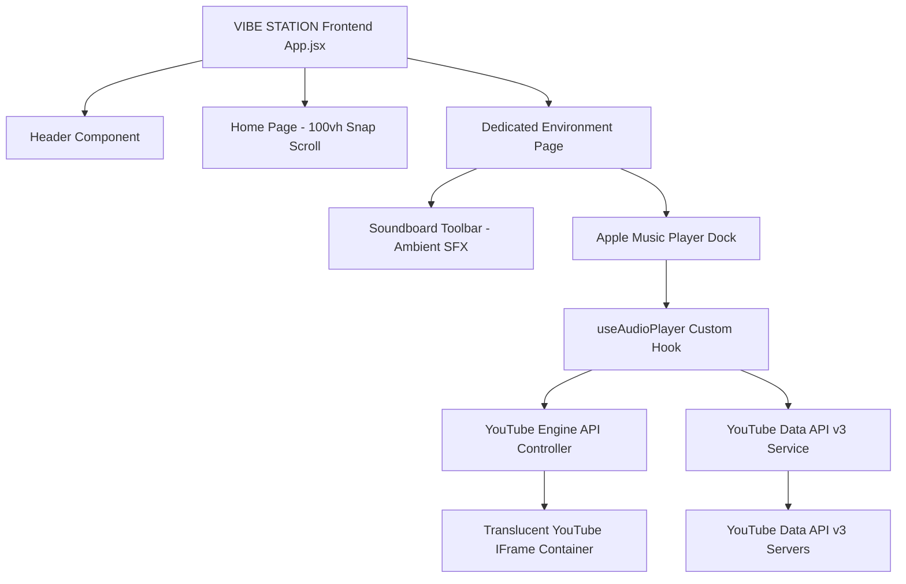

# 🎧 VIBE STATION
> **"Where places become music."**

[](https://reactjs.org/)
[](https://vitejs.dev/)
[](https://tailwindcss.com/)
[](https://www.framer.com/motion/)
[](https://developers.google.com/youtube/v3)
[](LICENSE)

---

## 📌 Executive Overview

**VIBE STATION** is a high-end, immersive ambient music experience platform designed to transport listeners into nostalgic physical environments paired with iconic **90s Bollywood Melodies**. Inspired by Apple's VisionOS / macOS Sonoma tinted glass aesthetic, VIBE STATION seamlessly bridges ambient environmental soundscapes with real-time **YouTube Data API v3** music streaming and an interactive dual-soundboard engine.

---

## ✨ Key Features

- 💎 **Apple VisionOS & macOS Sonoma Tinted Glassmorphism**: Frosted glass navigation pills, dynamic ambient backdrops, subtle glow accents, and responsive micro-animations powered by Framer Motion.
- 🎵 **Curated 90s Bollywood YouTube Playlists**: Dedicated YouTube Music playlists tailored specifically for each distinct environment without cross-environment track leakage.
- ⚡ **YouTube IFrame Engine Architecture**: Direct playback integration via YouTube's official `YT.Player` API (`enablejsapi: 1`), enabling seamless volume, seeking, and non-stop auto-advancing playback.
- 🔊 **Interactive Ambient Soundboards**: Native environment sound FX buttons (Bus Horn `हॉर्न ओके प्लीज`, Scissors Cut & Blow Dryer `कैंची कट एवं ब्लो ड्रायर`, 4 Monsoon Rain & Thunder Tracks, 5 Morning Birds & Dawn Chimes) with independent volume & toggle controls.
- 🖼️ **Automated Background Visual Scene Rotation**: 6 HD scenes per environment that auto-rotate after every 2 tracks or on next/previous navigation clicks.
- 🚫 **No Autoplay Policy**: Respects browser media autoplay policies by preloading environment playlists cleanly without starting unexpected audio output on page load or section scroll.

---

## 🏛️ System Architecture



---

## 🗺️ Environment Matrix & Playlists

| Environment | Tagline & Ambience | Featured YouTube Playlist / Jukebox | Ambient SFX |
| :--- | :--- | :--- | :--- |
| **🚌 BUS** | Highway journeys, night bus window mist & road trip melodies. | **User 90s Bollywood Road Trip Playlist** (`PLeatb7hupNV_AWUl_7ttbsKeCQh8tF5N4`) — 59 Tracks (*Baazigar*, *Deewana*, *Krishna*, *Pardes*) | Truck Horn (`हॉर्न ओके प्लीज`) |
| **💇 SALON** | Vintage mirrors, warm mahogany reflections & saloon hits. | **Barber Saloon Hits 90's Collection** (`uIYFObB-yv0`) — 20 Hits (*Pankaj Udhas*, *Udit Narayan*, *Alka Yagnik*) | Scissors Cut (`कैंची कट`) & Blow Dryer (`ब्लो ड्रायर`) |
| **🌧️ RAIN** | Raindrops on window, distant thunder & monsoon ballads. | **Monsoon Songs Romantic Rain Jukebox** (`rYWP4W8noLU`) — 17 Hits (*Taal*, *Sarfarosh*, *Barsaat*, *Mohra*) | 4 Rain & Thunder Tracks (`शांत वर्षा`, `हल्की फुहार`, `गर्जन`) |
| **🌅 MORNING** | Sunbeams over rolling mist, temple chimes & dawn bhajans. | **T-Series Bhakti Sagar Best Collection** (`4k3ZRQ5Hi6c`) — 12 Bhajans (*Gulshan Kumar*, *Anuradha Paudwal*, *Hariharan*) | 5 Morning Birds & Dawn Chimes (`प्रभात पक्षी गान`, `गांव की भोर`) |

---

## 🛠️ Tech Stack & Engineering Standards

- **Core Framework**: React 18.3 + Vite 5.4 (HMR & fast production builds)
- **Styling & Design Token System**: Vanilla CSS Glassmorphism + TailwindCSS 3.4
- **Animation Framework**: Framer Motion 11.5
- **Icons & Typography**: Lucide React + Google Fonts (*Outfit*, *Plus Jakarta Sans*, *Baloo 2*, *Yatra One*)
- **Media Engine**: YouTube Data API v3 + YouTube IFrame Player API (`YT.Player`)

---

## 🚀 Getting Started

### Prerequisites
- **Node.js**: `v18.0.0` or higher
- **npm**: `v9.0.0` or higher

### Installation & Setup

1. **Clone Repository**:
   ```bash
   git clone https://github.com/OmRaj6666/HotelAZureBooking.git
   cd "Vibe Station"
   ```

2. **Install Dependencies**:
   ```bash
   npm install
   ```

3. **Configure YouTube API Key**:
   Ensure `src/config/youtube.js` contains your active YouTube Data API Key:
   ```javascript
   export const YOUTUBE_API_KEY = 'YOUR_YOUTUBE_API_KEY';
   ```

4. **Start Development Server**:
   ```bash
   npm run dev
   ```
   Open `http://localhost:3000/` in your browser.

5. **Build Production Bundle**:
   ```bash
   npx vite build
   ```

---

## 📂 Directory Structure

```text
Vibe Station/
├── public/
│   └── assets/                  # High resolution HD scenes & ambient sound FX (.mp3, .jpg)
├── src/
│   ├── audio/
│   │   └── youtubeEngine.js     # YT.Player IFrame API controller & event lifecycle
│   ├── components/
│   │   ├── Header.jsx           # VisionOS floating glass pill header bar
│   │   └── MusicPlayer.jsx      # Apple Music style frosted glass player dock
│   ├── config/
│   │   └── youtube.js           # YouTube Data API v3 key & playlist ID configurations
│   ├── data/
│   │   └── environments.js      # Environment definitions, HD scenes & dedicated track schemas
│   ├── hooks/
│   │   └── useAudioPlayer.js    # Per-environment audio state & scene auto-rotation hook
│   ├── pages/
│   │   ├── DedicatedEnv.jsx     # Dedicated environment page with soundboard toolbar
│   │   └── Home.jsx             # 100vh full-screen snap scroll hero sections
│   ├── services/
│   │   └── youtubeApi.js        # YouTube Data API v3 playlist fetcher & search service
│   ├── App.jsx                  # Root App layout container & player element wrapper
│   ├── index.css                # Glassmorphism utilities (.apple-glass, .apple-pill)
│   └── main.jsx                 # React DOM entry point
├── package.json
├── vite.config.js
└── README.md
```

---

## 👤 Credits & Attribution

- **Created & Maintained by**: **[Om Raj](https://www.linkedin.com/in/om-raj-vit/)** (`© Om Raj`)
- **Design Inspiration**: Inspired by the UI/UX design work of **[Ujjwal Raj](https://www.linkedin.com/in/raj-ujjwal/)**
- **Media Content**: Curated 90s Bollywood Audio & Video streams powered by **YouTube Data API v3** & **YouTube Music**.

---

© 2026 **VIBE STATION**. All Rights Reserved.
